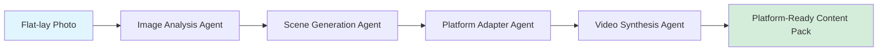

# StyleForge AI 🎨

[](https://www.python.org/downloads/)
[](LICENSE)
[](https://github.com/mrningzeoutlook-pixel/styleforge-ai)

**AI-Powered Content Generation Pipeline for Social Commerce**

StyleForge AI automates the entire content creation workflow for cross-border e-commerce, specifically designed for plus-size fashion brands. Upload a simple flat-lay photo and get platform-optimized images and videos for Xiaohongshu, Douyin, TikTok, and Instagram.

## 🎯 Problem Statement

In cross-border e-commerce, especially plus-size fashion, creating social media content is extremely time-consuming and expensive:

- **High Cost**: Professional photography, models, and video editing cost thousands per product SKU
- **Platform Fragmentation**: Each platform requires different aspect ratios, styles, and formats
- **Time to Market**: Traditional workflow takes weeks from photoshoot to published content
- **Inconsistent Quality**: Manual editing leads to brand inconsistency across platforms

## ✨ Solution

StyleForge AI leverages multi-agent AI pipelines to automate the entire content creation process:



## 🏗️ Architecture

### Multi-Agent Pipeline

| Agent | Responsibility | Input | Output |
|-------|---------------|--------|---------|
| **ImageAnalysisAgent** | Extract garment features, colors, patterns | Flat-lay image | Feature dictionary |
| **SceneGenerationAgent** | Generate model-wearing scenes with diverse body types | Features + Platform config | Multiple scene images |
| **PlatformAdapterAgent** | Resize, restyle, optimize for platform specs | Scene images + Platform specs | Platform-optimized images |
| **VideoSynthesisAgent** | Create beat-synced short videos | Adapted images + Music | 8-second MP4 video |

### Supported Platforms

| Platform | Aspect Ratio | Resolution | Video Duration | Style |
|----------|-------------|-------------|----------------|--------|
| Xiaohongshu (小红书) | 3:4 | 1080×1440 | 8s | Warm, lifestyle, aesthetic |
| Douyin (抖音) | 9:16 | 1080×1920 | 8s | Trendy, dynamic, bold |
| TikTok | 9:16 | 1080×1920 | 8s | Viral, energetic, inclusive |
| Instagram | 4:5 | 1080×1350 | 8s | Curated, premium, editorial |

## 🚀 Quick Start

### Prerequisites

- Python 3.11+
- API keys for AI services (OpenAI/Replicate)

### Installation

```bash
# Clone the repository
git clone https://github.com/mrningzeoutlook-pixel/styleforge-ai.git
cd styleforge-ai

# Create virtual environment (recommended)
python -m venv venv
source venv/bin/activate  # On Windows: venv\Scripts\activate

# Install dependencies
pip install -r requirements.txt

# Configure API keys
cp .env.example .env
# Edit .env with your API keys
```

### Basic Usage

```bash
# Generate content for a single product
python styleforge.py \
  --input ./photos/garment.jpg \
  --platforms xiaohongshu,douyin \
  --output ./output/ \
  --variants 3

# Skip video generation (images only)
python styleforge.py \
  --input ./photos/garment.jpg \
  --platforms instagram \
  --no-video
```

### Python API

```python
from styleforge import StyleForgePipeline

# Initialize pipeline
pipeline = StyleForgePipeline()

# Run full pipeline
results = pipeline.run(
    input_path="./photos/dress.jpg",
    platforms=["xiaohongshu", "douyin"],
    output_dir="./output",
    num_variants=3,
    generate_video=True
)

# Access results
for platform, content in results.items():
    print(f"{platform}: {len(content['images'])} images")
    if content['video']:
        print(f"  Video: {content['video']}")
```

## 📂 Project Structure

```
styleforge-ai/
├── src/                    # Source code
│   ├── agents/            # Agent implementations
│   ├── config/            # Platform configurations
│   └── utils/             # Utility functions
├── tests/                  # Unit and integration tests
├── docs/                   # Documentation
│   ├── API.md             # API reference
│   ├── ARCHITECTURE.md    # Architecture details
│   └── CONTRIBUTING.md    # Contribution guidelines
├── examples/               # Usage examples
├── scripts/                # Utility scripts
├── .github/                # GitHub workflows
│   └── workflows/         # CI/CD pipelines
├── styleforge.py           # Main entry point
├── requirements.txt        # Python dependencies
├── setup.py                # Package setup
├── .env.example            # Environment template
├── Dockerfile              # Docker configuration
└── README.md              # This file
```

## 🔧 Configuration

### Environment Variables (.env)

```bash
# AI Service API Keys
OPENAI_API_KEY=your_openai_key_here
REPLICATE_API_TOKEN=your_replicate_token_here

# Optional: Custom API endpoints
OPENAI_BASE_URL=https://api.openai.com/v1

# Output settings
OUTPUT_DIR=./output
LOG_LEVEL=INFO

# Platform settings
DEFAULT_PLATFORMS=xiaohongshu,douyin
```

### Platform Configuration

Edit `src/config/platforms.py` to customize platform settings:

```python
PLATFORMS = {
    "xiaohongshu": PlatformConfig(
        name="xiaohongshu",
        aspect_ratio="3:4",
        image_width=1080,
        image_height=1440,
        video_duration=8.0,
        style_prompt="warm, lifestyle, aesthetic, soft lighting",
        music_genre="lo-fi, chill"
    ),
    # Add more platforms...
}
```

## 🎨 Use Cases

### 1. Product Testing
Quickly test which styles resonate on social media before mass production:

```bash
python styleforge.py \
  --input ./test/garment_variants/*.jpg \
  --platforms xiaohongshu,douyin,tiktok \
  --output ./test_results/
```

### 2. Content Marketing
Generate weeks of content in minutes:

```bash
# Batch process entire catalog
python scripts/batch_process.py \
  --input-dir ./catalog/ \
  --output-dir ./content_calendar/ \
  --schedule 7d
```

### 3. Cross-border Localization
Adapt visual content for different markets:

```python
# Generate region-specific content
pipeline.run(
    input_path="./photos/summer_dress.jpg",
    platforms=["xiaohongshu"],  # China market
    cultural_adaptation=True
)
```

### 4. Inclusive Representation
Ensure diverse body types in AI-generated imagery:

```python
# Enable plus-size model generation
config = PlatformConfig(
    include_plus_size=True,
    body_types=["plus-size", "curvy", "inclusive"],
    diversity_score_threshold=0.85
)
```

## 📊 Roadmap

- [x] **v0.1** - Core image generation pipeline (Q1 2026)
- [x] **v0.2** - Multi-platform output formatting (Q1 2026)
- [ ] **v0.3** - 8-second beat-synced video generation (Q2 2026)
- [ ] **v0.4** - Batch catalog processing (Q2 2026)
- [ ] **v0.5** - A/B testing integration with social media APIs (Q3 2026)
- [ ] **v1.0** - Analytics dashboard for content performance (Q4 2026)
- [ ] **v1.5** - Fine-tuned models for fashion domain (Q1 2027)

## 🧪 Testing

```bash
# Run all tests
pytest tests/

# Run with coverage
pytest --cov=src tests/

# Run specific test file
pytest tests/test_pipeline.py -v
```

## 🤝 Contributing

We welcome contributions! Please see [CONTRIBUTING.md](docs/CONTRIBUTING.md) for guidelines.

### Development Setup

```bash
# Install development dependencies
pip install -r requirements-dev.txt

# Run linters
flake8 src/
black src/

# Run type checking
mypy src/
```

## 📚 Documentation

- [API Reference](docs/API.md) - Detailed API documentation
- [Architecture Guide](docs/ARCHITECTURE.md) - Deep dive into system design
- [Agent Specification](docs/AGENTS.md) - Agent protocol and interfaces
- [Platform Guide](docs/PLATFORMS.md) - Adding new platform support

## 🛠️ Built With

- **Python 3.11+** - Core runtime
- **OpenAI API** - GPT-4V for image analysis
- **Replicate** - Image generation (SDXL, DALL-E)
- **MoviePy** - Video synthesis and editing
- **Pillow** - Image processing
- **python-dotenv** - Environment management

## 📝 License

This project is licensed under the MIT License - see [LICENSE](LICENSE) for details.

## 👤 Author

**Mary Ma (马女士)**
- GitHub: [@mrningzeoutlook-pixel](https://github.com/mrningzeoutlook-pixel)
- Location: Hangzhou, China 🇨🇳
- Background: International Trade → AI Entrepreneurship
- Focus: Plus-size fashion, social commerce, AI applications

## 🙏 Acknowledgments

- Inspired by the need for inclusive representation in fashion AI
- Built for cross-border e-commerce entrepreneurs
- Thanks to the open-source AI community

## 📮 Contact

For business inquiries or collaboration:
- Open an [Issue](https://github.com/mrningzeoutlook-pixel/styleforge-ai/issues)
- Connect on [LinkedIn](https://linkedin.com/in/mary-ma-ai)

---

<p align="center">
  <strong>Built with AI Agents for Real-World Commerce 🚀</strong>
</p>
